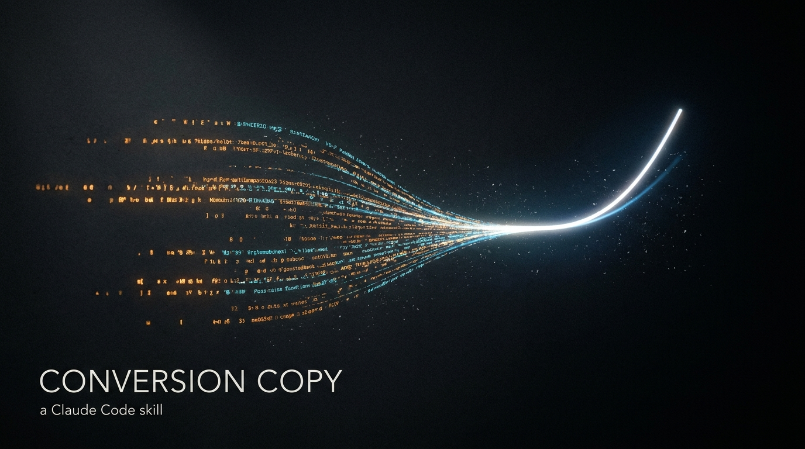

# Examples

Five things this skill is genuinely good at, each shown end to end: the diagnosis, the copy, and a short backstage note on why it's built the way it is.

> Every number, testimonial, and scarcity claim below is a **placeholder**. The skill never invents proof — it marks the spot and tells you to drop in the real thing. Swap them before you ship.

---

## 1. Diagnose & rewrite (the skill's highest-leverage move)

You paste flat copy. The skill finds the single biggest leak, rewrites it, and ranks the fixes. This is where it earns its keep.

**Before** — a real-feeling SaaS hero, full of machine tells:

> **Unlock the Power of Seamless Project Management**
> In today's fast-paced world, managing projects isn't just about tracking tasks, it's about empowering your team to thrive. Our robust, comprehensive platform leverages cutting-edge AI to foster collaboration, streamline workflows, and elevate productivity. From startups to enterprises, TaskFlow serves as a testament to what modern work can be. Start your journey today.

**Biggest leak:** No concrete claim, no proof, no reason to click. The reader can't tell what it *does* differently in five seconds, so they bounce. (Solution-aware audience, sophistication 3+ — they've seen ten "AI project tools," so only a mechanism plus specifics lands.)

**After:**

> **Your team ships late because status lives in six places at once.**
> TaskFlow pulls every task, message, and deadline onto one board that updates itself. No status meetings. No "who owns this?" threads at 9pm. Connect Slack, GitHub, and Google Calendar in about four minutes, and watch the first week's chaos sort itself.
> The 1,800 teams who switched last year cut their average project overrun from 11 days to 2.
> **[ Start free — your first board is live in 5 minutes ]**

**Why it's better:** Opens on an agitated, concrete problem instead of a brochure adjective. Names a real mechanism (one self-updating board). Trades "elevate productivity" for an 11→2-days proof point. Kills the "it's not just X, it's Y" construction, the rule-of-three filler, and the "serves as a testament" tail. Test the headline first.

---

## 2. Landing page hero (write mode, cold-to-warm)

**Brief:** A sleep supplement. Audience is problem-aware and tired of melatonin that leaves them groggy. Sophistication is high, so the claim needs a mechanism, not a louder promise.

> **Fall asleep without the 6am hangover.**
> Melatonin knocks you out and then makes you pay for it — foggy, heavy, reaching for a second coffee by ten. Rest works the other way. It uses a low-dose magnesium glycinate and L-theanine blend that calms the nervous system instead of sedating it, so you drift off in about twenty minutes and wake up clear.
> No grogginess. No dependency. No "did I even sleep?"
> 9,000 people take it nightly. The average reviewer fell asleep 23 minutes faster by night four.
> **[ Try 30 nights — sleep on it, literally. Full refund if you don't. ]**

**Why it works:** The headline channels the *real* frustration (the morning, not the night). The mechanism — "calms instead of sedating" — makes a tired category believable again. Proof is specific and modest, never bigger than what a supplement can honestly claim. The guarantee removes the only real risk.

---

## 3. Cold email (B2B, problem-aware, ice cold)

**Brief:** Selling a contract-review tool to in-house legal counsel. They get 50 cold emails a week. The job is to look like a person, not a sequence, and earn one reply.

> **Subject: the 40-page MSA on your desk right now**
>
> Hi Dana,
>
> You probably have a vendor contract open in another tab. Most GCs I talk to are sitting on a backlog of 15–20 of them, redlining the same indemnity and liability clauses by hand, again.
>
> We built Clause to do the first pass. It flags the non-standard terms against your own playbook in about 90 seconds, so you review exceptions instead of reading every line.
>
> Worth 15 minutes? I'll show you it on one of your actual contracts, not a demo doc.
>
> — Marco
>
> P.S. If contract volume isn't your bottleneck this quarter, just say so and I'll close the loop.

**Why it works:** The subject names a specific object in the reader's world, not a benefit. The opening line enters the conversation already in their head (Collier). One mechanism, one specific number, one small ask. The P.S. gives an honest out, which paradoxically lifts replies. No "I hope this finds you well," no "revolutionary," no three-paragraph windup.

---

## 4. Product description (ecommerce, product-aware, status-driven)

**Brief:** A heavy brass everyday-carry pen, $40. The buyer already owns pens. The enemy isn't "no pen" — it's the drawer of free ones.

> **The pen you'll still own when the contract is dust.**
> Pick it up. Heavier than you expected. That's machined brass, not the hollow plastic that cracks in your bag by March — it has weight because what you do with it has weight.
> You don't need another pen. You've got the bank's freebies and the four-color thing your kid left. They write. Fine. They also say nothing about the hand holding them.
> This one does. Uncap it across a table and the room hears a low, solid click. Refills cost three dollars and last a year, so this is the last pen you buy. Not this year. Ever.
> **30-day return. Use it hard.** If it doesn't change how it feels to put your name on something, send it back and keep the refill on us.

**Why it works:** Sells the *moment of signing* and the status inside it, not "smooth ink." Dimensionalizes the benefit into a felt scene. The "$3 refill, last pen ever" reframes a $40 price as a one-time cost. Honesty trigger up front (it's heavy, it's not for everyone). One em dash.

---

## 5. Ad copy variations (paid social, scroll-stopping, built to A/B)

**Brief:** A meal-prep service for people who keep ordering takeout at 9pm. Three distinct *angles* on the same offer, because the highest-leverage test is angle, not word choice.

**Angle A — the guilt (problem-agitate):**
> You opened the food app again, didn't you. Third night this week. Rune drops five chef-cooked dinners on your doorstep Sunday — heat one in 4 minutes, skip the $19 delivery shame spiral. First box is $35 off.

**Angle B — the math (rational buyer):**
> Takeout four nights a week ≈ $76. Five Rune dinners ≈ $45, delivered, no tip, no wait. Same effort: open fridge, press microwave. First box $35 off.

**Angle C — the identity (aspirational):**
> The version of you who eats a real dinner at home isn't more disciplined. They just stopped deciding at 9pm. Rune decides for you on Sunday. First box, $35 off.

**Why it works:** One offer, three psychological doors — guilt, logic, identity. You learn which *desire* the market responds to before you spend on optimizing a single line. Each is one thought, scannable on a phone, with the same concrete hook ($35 off, 4-minute heat). Test the angle, then the winner's first five words.

---

**Want to run the skill yourself?** See the [README](README.md) for install, or just ask Claude to write or fix any copy with the skill active.

*Examples written with the skill's own standard: diagnose first, specifics over adjectives, real rhythm, no machine tells.*

